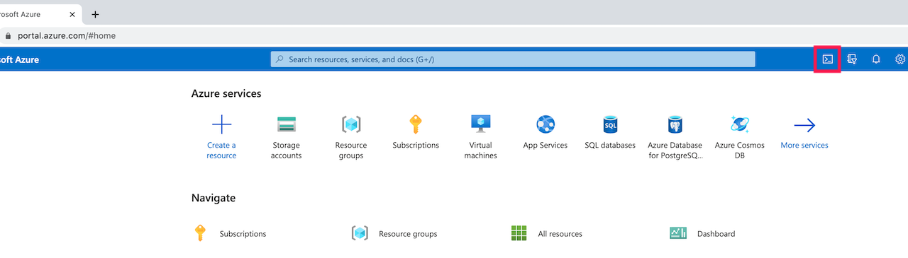

For the labs in this class you will need to be logged into the Azure portal.  The instructor should have sent you credentials to log in.

Go to http://portal.azure.com. You will be redirected to a login page for Azure.

If there are any accounts listed on the login page, you should ignore them since those will not provide you with the necessary access for this class.  Click "Use another account", which will ask for an email address as your login.  Use the email address that was sent to you for the class.  Click "Next" and enter the password that was sent to you for the class.  Click "Submit", and you should be taken to the main Azure Portal page.

At the top of the portal, find the icon to open a console window for Cloud Shell.



Pick Bash for the shell.  If you get a dialog saying that Cloud Shell requires you create a storage account, click Okay.  Sometimes it takes a short while to create the storage account.

Once in the shell, type "ls" to see that there is one sub-directory called "clouddrive" in your home.  Change to that sub-directory.

```
cd clouddrive
```

For this lab, create a new subdirectory in which to work.

```
mkdir tflabs
```

Change to the new directory.

```
cd tflabs
```

You are now set to proceed with the labs for the class.
