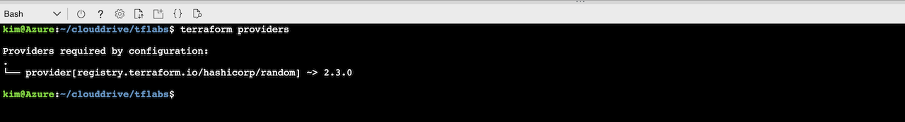

# Using a Provider

Lab Objective:
- Create an initial Terraform configuration by specifying a provider

## Preparation

Be sure to have completed the instructions on the "environment-setup" page.

## Lab

For this lab we will be using a provider called "random".

Create a file called "main.tf":

```
touch main.tf
```

Open the file for edit.  You can either use "vim" or you can use the built-in editor in the CloudShell".  To open the built-in editor, click the "Open Editor" icon (looks like curly braces) above the console area.  In the file editor, expand the directory tree on the left.

Create a terraform block to specify that "random" is a required provider.  We also specify that we want to use version 0.13.0 or above for the Terraform version.

```
terraform {
  required_providers {
    random = {
      source  = "hashicorp/random"
      version = "~> 2.3.0"
    }
  }
  required_version = "~> 0.13.0"
}
```

Add a provider block to configure the "random" provider. This provider does not require any special configuration.

```
provider "random" {
}
```

Save the file.  (If you are using the built-in editor, the Save will be under the "..." icon in the upper right of the file editor area.)

> For all the labs, the solution code for the lab is contained in the solution folder.  If you want to check your code or need some help, you can always look or copy the solution code.

To see what you have done, run the following command:

```
terraform providers
```

You should see the following output showing that Terraform recognizes the provider you are wanting to use.


