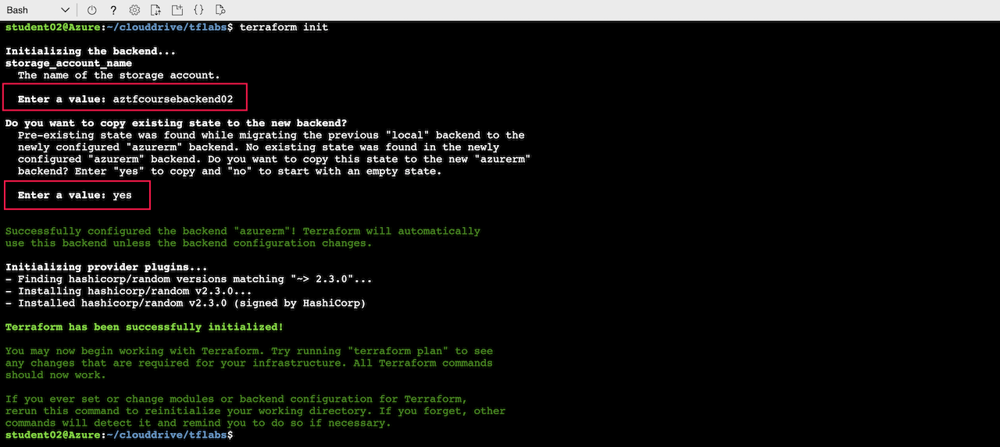

# Using Azure Backend

Lab Objective:
- Save Terraform state to backend in Azure storage

## Preparation

If you did not complete lab 2.2, you can simply copy the code from that lab as the starting point for this lab.

## Lab

Since we will want to show migration of state from local to remote, run terraform apply to ensure there is current state:

```
terraform apply
```

(If there was current state already, then the apply will show nothing to create; otherwise accept the changes to apply.)


### Authenticate to Azure CLI

If you are running this lab in the Azure Cloud Shell, then Azure CLI authentication was already automatically done when you opened Cloud Shell.  

> If you are running this lab from a terminal shell outside of the Azure portal, then you would need to use the Azure CLI to authenticate by typing "az login" which will direct you to a browser login page to log into the Azure CLI.

### Update Terraform configuration

We will be configuring a backend to store the terraform state in an Azure storage blob.  The storage account and container were already set up prior to the class.  The backend state will be stored in a new blob created in the container.

Edit “main.tf” to add a backend for Azure.  Add the following as a sub-block in the terraform block.  *Make sure you are putting the new code inside the terraform block and not at the end of the file or another arbitrary location.*

```
  backend "azurerm" {
    resource_group_name  = "terraform-course-backend"
    container_name       = "tfstate"
    key                  = "cprime.terraform.labs.tfstate"
  }
```

Your resulting terraform block should look as follows:
```
terraform {
  required_providers {
    random = {
      source  = "hashicorp/random"
      version = "~> 2.3.0"
    }
  }
  backend "azurerm" {
    resource_group_name  = "terraform-course-backend"
    container_name       = "tfstate"
    key                  = "cprime.terraform.labs.tfstate"
  }
  required_version = "~> 0.13.0"
}
```

This will now direct the state to be saved in Azure.  Since you changed the backend configuration, you will need to run terraform init again.

A missing argument in the backend configuration above is the specification of an Azure storage account.  Terraform will therefore prompt you to enter the storage account name when you run terraform init.  The storage account name will be "aztfcoursebackendNN" where NN is your username sequence number.  For example, if your username for logging into Azure was "student05" then your sequence number would be "05" (from the end of the username) and the storage account name would be "aztfcoursebackend05".

Run:

```
terraform init
```

Terraform will prompt you for the storage account name. Type the name as per the instructions above.   

> If you enter the wrong storage account name, you will get an error.  Unfortunately you will not be able to just re-run terraform init.  You must first remove the .terraform subdirectory by typing "rm -rf .terraform".  You can then re-run terraform init.

Terraform will then prompt you to migrate the existing state from the “terraform.tfstate” file to the backend in Azure.

Type “yes”



Terraform will copy the state to Azure.  The state will be saved in a new Azure storage blob referenced in the backend configuration above.

Notice that the terraform.tfstate file is left remaining.  You should delete the file to avoid confusion.

```
rm terraform.tfstate*
```

To confirm that the state still exists, use terraform show.

```
terraform show
```


