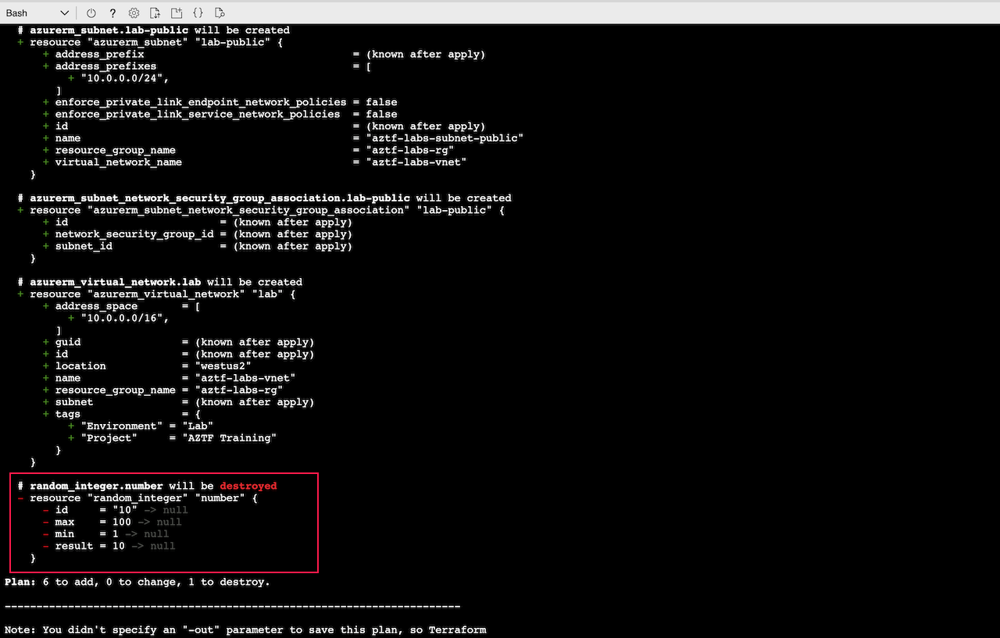
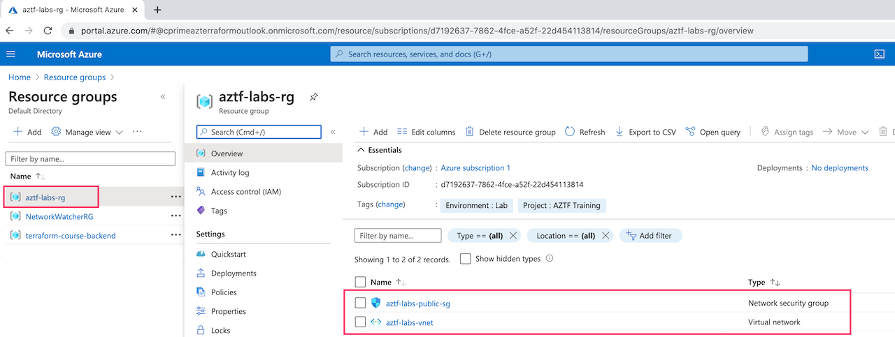
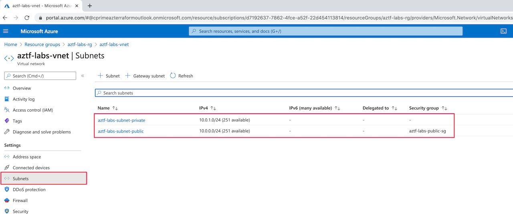

# Create a Network

Lab Objective:
- Create a simple network in Azure

## Preparation

If you did not complete lab 2.3, you can simply copy the code from that lab as the starting point for this lab.

## Lab

Copy the file "main.tf" from the code folder to replace the existing main.tf file.

Let's walk through what is changed in this file:

1. We have removed "random" as a required_provider and replaced it with using Azure RM as a required provider.

```
required_providers {
  azurerm = {
    source  = "hashicorp/azurerm"
    version = ">= 2.20, < 3.0"
  }
}
```

2. We have included a provider block to configure the Azure provider.  We will be using the default configuration of the provider.

```
provider "azurerm" {
  features {}
}
```

3.  We have added a resource for an Azure resource group.  In Azure, most resources need to be part of a resource group, so this resource will be referenced extensively.

```
resource "azurerm_resource_group" "lab" {
  name     = "aztf-labs-rg"
  location = "westus2"
  tags     = {
    Environment = "Lab"
    Project     = "AZTF Training"
  }
}
```

4. We have added a resource for a virtual network.  

```
resource "azurerm_virtual_network" "lab" {
  name                = "aztf-labs-vnet"
  location            = "westus2"
  resource_group_name = azurerm_resource_group.lab.name
  address_space       = ["10.0.0.0/16"]
  tags                = {
    Environment = "Lab"
    Project     = "AZTF Training"
  }
}
```

5. We have added a resource for two subnets (a public and private subnet).  Notice that the subnet CIDR blocks are within the VNet CIDR range.

```
resource "azurerm_subnet" "lab-public" {
  name                 = "aztf-labs-subnet-public"
  resource_group_name  = azurerm_resource_group.lab.name
  virtual_network_name = azurerm_virtual_network.lab.name
  address_prefixes     = ["10.0.0.0/24"]
}

resource "azurerm_subnet" "lab-private" {
  name                 = "aztf-labs-subnet-private"
  resource_group_name  = azurerm_resource_group.lab.name
  virtual_network_name = azurerm_virtual_network.lab.name
  address_prefixes     = ["10.0.1.0/24"]
}
```

6. We have added a resource for a security group.  For now we do not include a security group rule.

```
resource "azurerm_network_security_group" "lab-public" {
  name                = "aztf-labs-public-sg"
  location            = "westus2"
  resource_group_name = azurerm_resource_group.lab.name
}
```

7. We have added a resource to associate the security group to the public subnet.

```
resource "azurerm_subnet_network_security_group_association" "lab-public" {
  subnet_id                 = azurerm_subnet.lab-public.id
  network_security_group_id = azurerm_network_security_group.lab-public.id
}
```

Run terraform init:  (Do you know why we need to re-run this command?)
```
terraform init
```
Run terraform validate:
```
terraform validate
```
Run terraform plan:
```
terraform plan
```
(If you see in the plan that random_integer.number is to be destroyed, that is okay.  Do you know why this is happening?)


<br /><br />

Run terraform apply:
```
terraform apply
```

### Viewing Results in the Azure Portal

Let's use the Azure Portal to see what we just created.  Minimize the Cloud Shell console so you can see the Azure Portal UI fully.

In search bar at top, type in “resource”.  Select “Resource Groups” from the auto suggest drop-down.

You should see the following:


<br /><br />

Click on the "aztf-labs-rg" resource group created by Terraform. (The other resource groups were created by other means in support of this class. You can ignore them.)

Confirm you see the virtual network and security group listed.<br />



<br /><br />
Click on the virtual network and confirm it has the expected subnet, and that the subnet has the expected security group.


