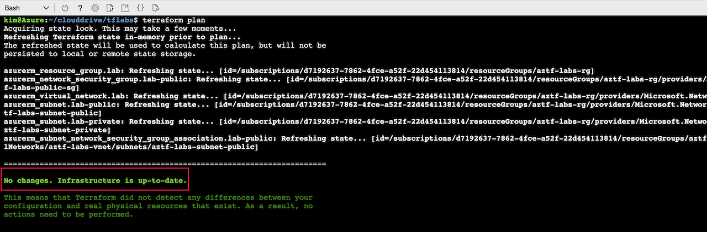

# Using Locals

Lab Objective:
- Use locals to set values used more than once

## Preparation

If you did not complete lab 3.1, you can simply copy the code from that lab (and run terraform apply) as the starting point for this lab.

## Lab

Open the file “main.tf”.

Look through the code to see what literal values are used more than once.  What do you come up with?

In your main.tf file open for edit, add a locals block below the provider block and set two local values:
```
locals {
  region = "westus2"
  common_tags = {
    Environment = "Lab"
    Project     = "AZTF Training"
  }
}
```

Replace the location and tag values in the following resources with references to the local value:
- azurerm_resource_group
- azurerm_virtual_network
- azurerm_network_security_group

Compare your file to the code in the solution folder.  Run terraform validate to confirm your edits are okay.  
```
terraform validate
```

Run terraform plan:

```
terraform plan
```

Confirm that the plan does not come up with any changes to make to the actual infrastructure in Azure.

