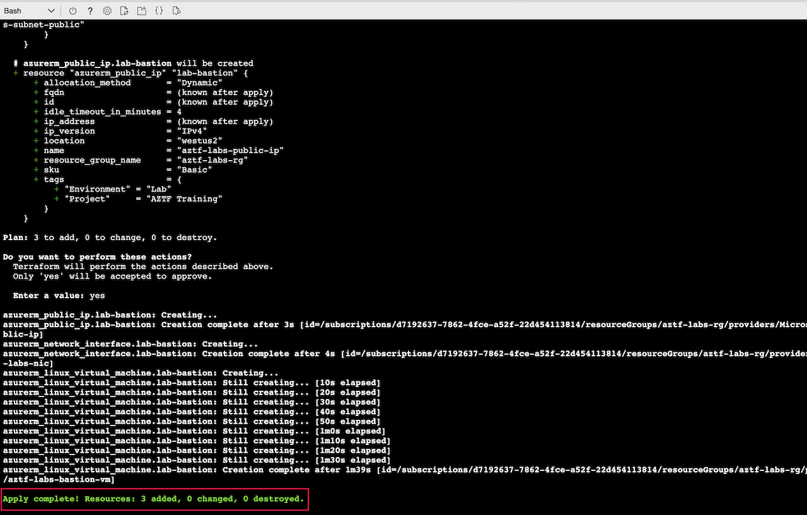
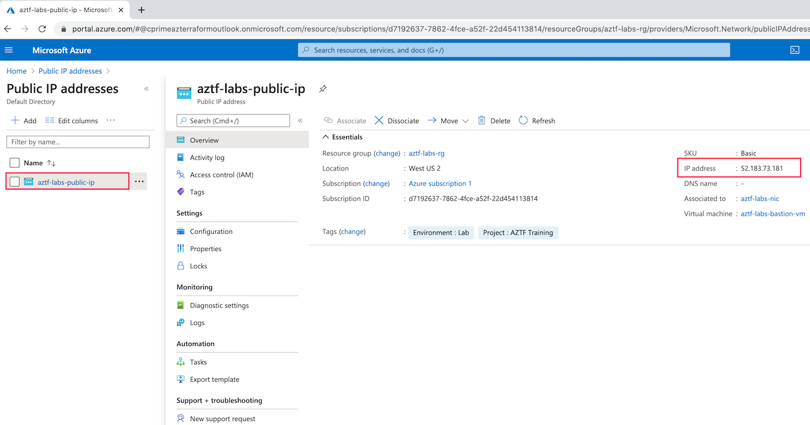
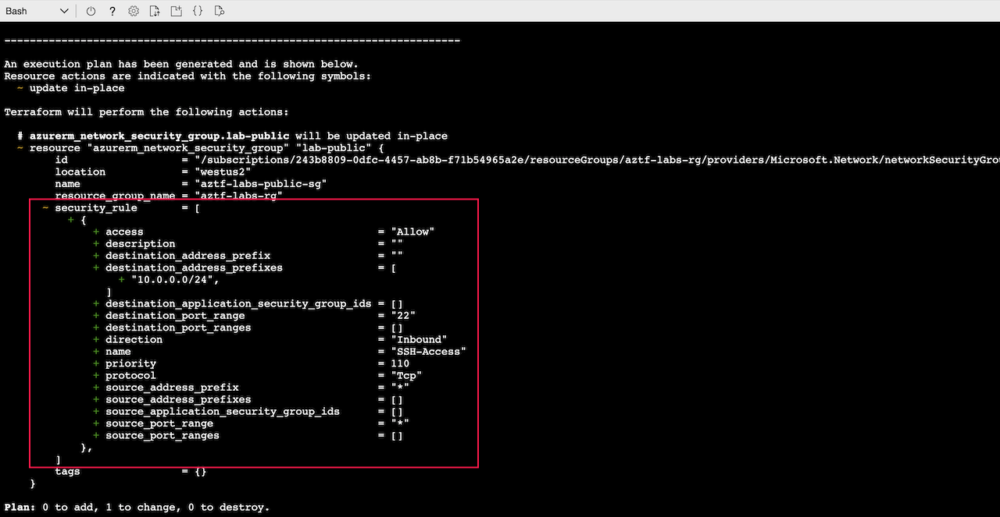
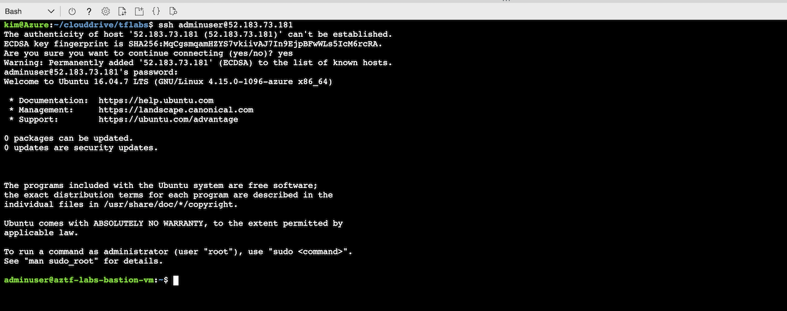

# Virtual Machine

Lab Objectives:
- Create a virtual machine with a public IP
- See the effect of making a change to an existing resource

## Preparation

If you did not complete lab 3.2, you can simply copy the solution code from that lab (and run terraform apply) as the starting point for this lab.

## Lab

### Creating a Virtual Machine

The virtual machine we create in this lab is for a bastion host that has access from the public Internet.

Create a new file “vm.tf”.  If you are using the Cloud Shell built-in editor, you may need to hit the refresh icon in the file hierarchy view for the new file to show up in the hierarchy.

Add three new resources to this file.

1. A public IP address.
```
resource "azurerm_public_ip" "lab-bastion" {
  name                = "aztf-labs-public-ip"
  resource_group_name = azurerm_resource_group.lab.name
  location            = local.region
  allocation_method   = "Dynamic"
  sku                 = "Basic"
  tags                = local.common_tags
}
```

2. A network interface for the public IP to be in the public subnet.
```
resource "azurerm_network_interface" "lab-bastion" {
  name                = "aztf-labs-nic"
  resource_group_name = azurerm_resource_group.lab.name
  location            = local.region

  ip_configuration {
    name                          = "aztf-labs-app-ipconfig"
    subnet_id                     = azurerm_subnet.lab-public.id
    private_ip_address_allocation = "Dynamic"
    public_ip_address_id          = azurerm_public_ip.lab-bastion.id
  }

  tags = local.common_tags
}
```

3. A virtual machine. (For this lab we are allowing password access to the VM, but in practice you should use an SSH key instead for greater security.)
```
resource "azurerm_linux_virtual_machine" "lab-bastion" {
  name                  = "aztf-labs-bastion-vm"
  resource_group_name   = azurerm_resource_group.lab.name
  location              = local.region
  size                  = "Standard_B1s"
  network_interface_ids = [azurerm_network_interface.lab-bastion.id]
  admin_username        = "adminuser"
  admin_password        = "aztfVMpwd42"
  disable_password_authentication = false

  os_disk {
    caching              = "ReadWrite"
    storage_account_type = "Standard_LRS"
  }

  source_image_reference {
    publisher = "Canonical"
    offer     = "UbuntuServer"
    sku       = "16.04-LTS"
    version   = "latest"
  }

  tags = local.common_tags
}
```

Run terraform validate to make sure you have no errors:
```
terraform validate
```

Run terraform plan.  See that three new resources will be created.
```
terraform plan
```

Run terraform apply:
```
terraform apply
```


### Connect to the virtual machine

Let's try checking that the infrastructure actually works by connecting to the virtual machine.

To connect to the virtual machine, you need its public IP.  You can get this in a couple ways:

1. Run terraform show

    a. Scroll up in the output to find the state for the virtual machine.  One of its attributes should be public_ip_address

    

2. Go to the Azure Portal

    a. In the portal search bar, type “public”.  Select the “Public IP addresses” auto-suggestion in the drop-down.

    b. Click on the public IP from the lab, and then see the IP address shown.

    

<br /><br />
Once you find the public IP, SSH to the machine.  In the terminal console, type (substituting in the correct public IP):

```
ssh adminuser@<public-ip>
```
The ssh command will timeout and fail. (If it just hangs, then type ctl-c)  Can you figure out why it fails?   (Hint:  What is missing in the security group in main.tf?)   Let's fix that.

### Making Changes to An Existing Resource

To enable SSH access, we will need to add a security rule to enable TCP traffic in on port 22.

Add the following to the security group in the main.tf file.  To see where to add the code, go to the Terraform documentation page for "azurerm_network_security_group". (Or you can look at the code in the solution folder of this lab.)

```
  security_rule {
    name                       = "SSH-Access"
    priority                   = 110
    direction                  = "Inbound"
    access                     = "Allow"
    protocol                   = "Tcp"
    source_port_range          = "*"
    destination_port_range     = "22"
    source_address_prefix      = "*"
    destination_address_prefixes = azurerm_subnet.lab-public.address_prefixes
  }
```

Save the file and run terraform plan:
```
terraform plan
```

Notice that the plan shows an update to the security group.




Run terraform apply (remember to confirm yes to the changes):
```
terraform apply
```

When it finishes, try the ssh command again.  (You might need to wait a minute or two.)

This time it should prompt you for a password.  Enter the password that was configured in the vm.tf file.

*You may also be prompted to confirm that you want to connect. Enter "yes".*

Confirm you can ssh into the machine.



Exit the SSH session on the virtual machine.
