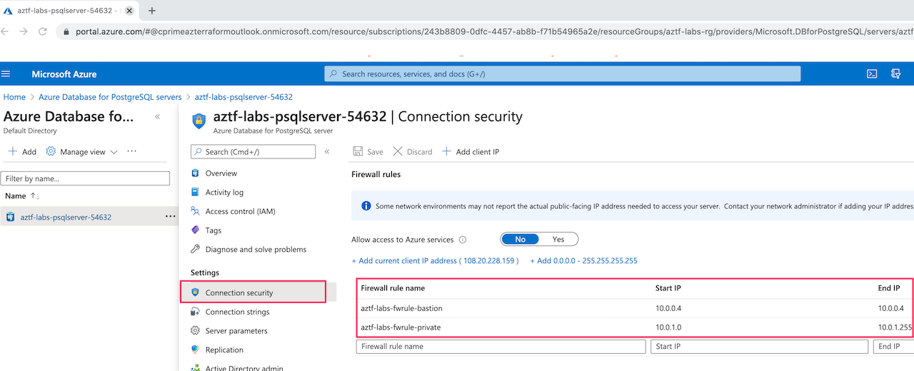

# Postgresql Database

Lab Objective:
- Add a Postgresql server and database to your infrastructure

## Preparation

If you did not complete lab 3.3, you can simply copy the code from that lab (and run terraform apply) as the starting point for this lab.

## Lab

Create a new file “database.tf”
```
touch database.tf
```

Open the file for edit to add five new resources.

1. A random number.  This will be needed as a suffix for the postgresql server name to make that server name unique in Azure.
```
resource "random_integer" "suffix" {
  min = 10000
  max = 99999
}
```

2. A PostgreSQL server:
```
resource "azurerm_postgresql_server" "lab" {
  name                = "aztf-labs-psqlserver-${random_integer.suffix.result}"
  location            = local.region
  resource_group_name = azurerm_resource_group.lab.name

  sku_name                      = "B_Gen5_1"
  version                       = "11"
  storage_mb                    = 5120
  public_network_access_enabled = true
  ssl_enforcement_enabled       = false

  administrator_login           = "psqladmin"
  administrator_login_password  = "AZtfl4b$"

  tags = local.common_tags
}
```

3. A database in the server:
```
resource "azurerm_postgresql_database" "lab" {
  name                = "aztf-labs-db"
  resource_group_name = azurerm_resource_group.lab.name
  server_name         = azurerm_postgresql_server.lab.name
  charset             = "UTF8"
  collation           = "English_United States.1252"
}
```

4. A firewall rule to enable database access from the private subnet.
```
resource "azurerm_postgresql_firewall_rule" "lab-rule1" {
  name                = "aztf-labs-fwrule-private"
  resource_group_name = azurerm_resource_group.lab.name
  server_name         = azurerm_postgresql_server.lab.name
  start_ip_address    = cidrhost(azurerm_subnet.lab-private.address_prefixes[0],0)
  end_ip_address      = cidrhost(azurerm_subnet.lab-private.address_prefixes[0],255)
}
```

5. A firewall rule to enable database access from the bastion host.
```
resource "azurerm_postgresql_firewall_rule" "lab-rule2" {
  name                = "aztf-labs-fwrule-bastion"
  resource_group_name = azurerm_resource_group.lab.name
  server_name         = azurerm_postgresql_server.lab.name
  start_ip_address    = azurerm_linux_virtual_machine.lab-bastion.private_ip_address
  end_ip_address      = azurerm_linux_virtual_machine.lab-bastion.private_ip_address
}
```

Look through the resources for a moment. What is the processing order dependency between the resources?

Run terraform validate to make sure you have no errors:
```
terraform validate
```

Run terraform plan and verify that only five new resources will be created.
```
terraform plan
```


Run terraform apply. (Remember to agree to the changes.)  The database server can sometimes take a few minutes to create.
```
terraform apply
```


### View Results in Azure Portal

Go to the Azure Portal.  Type “postgres” and select the “Azure Database for PostgreSQL servers” auto-suggestion.  (Do not pick “Azure Database for PostgreSQL servers v2”)


<br /><br />

Note the server name in the listing (you will need it later).  Click on the database server name in the list.


<br /><br />

Click on Connection Security under Settings in the left navigation pane to confirm the firewall rule is present.


<br /><br />

### Verify Database Connection

If you have extra time, you can confirm that you can connect to the database server.

(NOTE:  The current firewall rules restrict access only from within the virtual network.  For this lab, we will temporarily grant access from the Azure Cloud Shell.)

In Azure Portal, in the Connection Security screen for the database server, see the setting for “Allow access to Azure services”.  Change the setting to Yes.  Click Save icon to save the change.   You may need to wait a minute or so to get a pop-up notification that the change was successfully changed.


<br /><br />

Go back to the Cloud Shell console.

Enter the following command into the shell, substituting in the correct values for <SERVER_NAME>.  The server name is the resource name in the server list you saw in the Azure portal above (ending in the five digit random number).

```
psql --host=<SERVER_NAME>.postgres.database.azure.com --username=psqladmin@<SERVER_NAME> --dbname=postgres
```

You will get a password prompt.  Type in the password from the configuration file.

You should get a postgres prompt.  Type “\l”.  This will show the databases in the server.  Confirm your database is listed.


Exit the postgres prompt by typing "exit".
