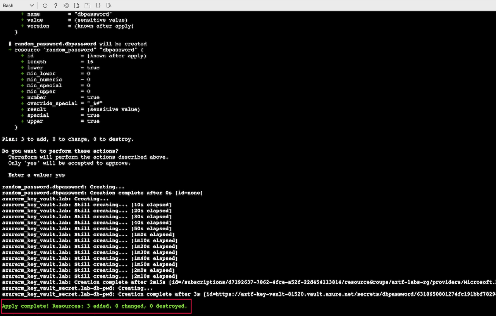
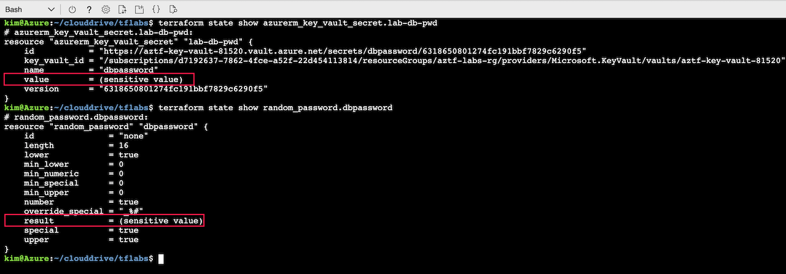
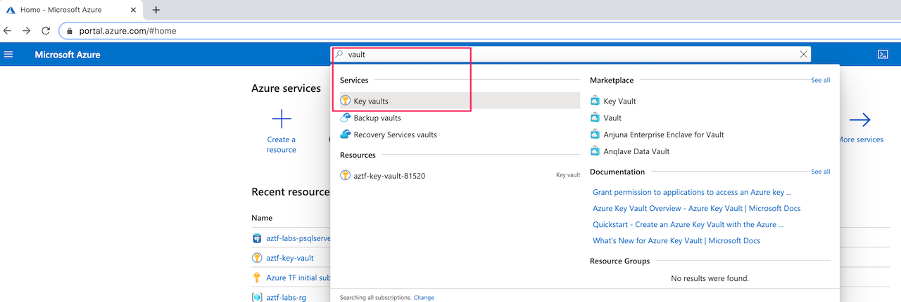
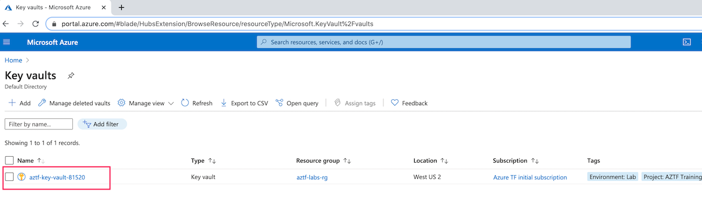
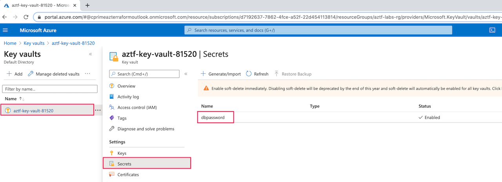
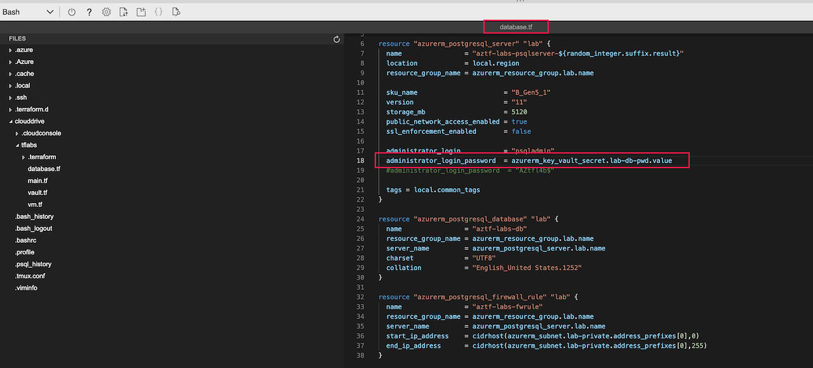
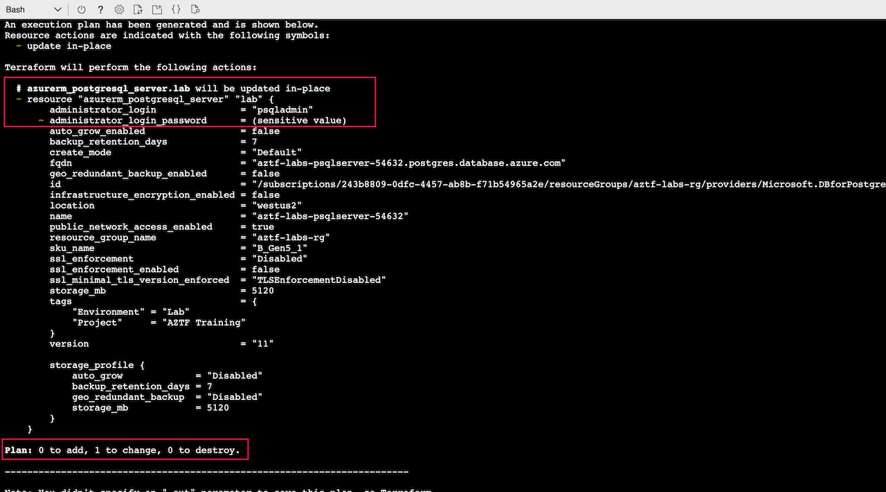
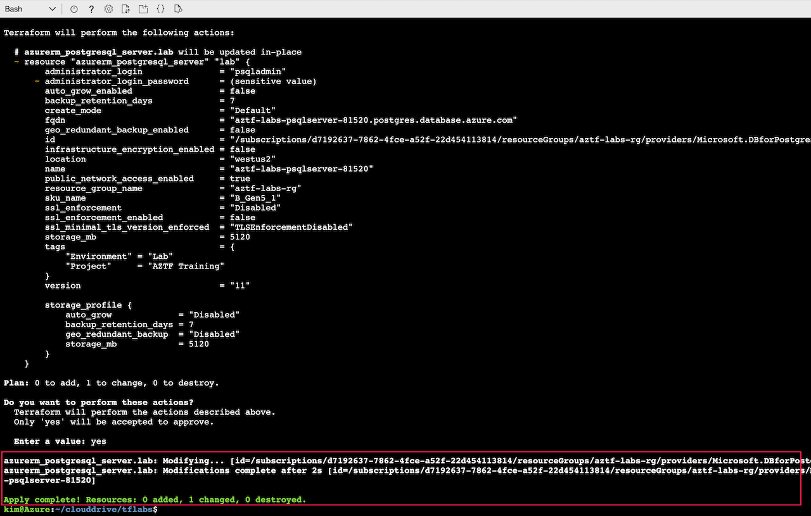

# Key Vault

Lab Objective:
- Create a key vault to protect a database password
- Update database resource to use secured password

## Preparation

If you did not complete lab 3.4, you can simply copy the solution code from that lab (and do terraform apply) as the starting point for this lab.

## Lab

### Create Key Vault

Create a new file “vault.tf”

Add three new resources to this file:

1. A random password
```
resource "random_password" "dbpassword" {
  length           = 16
  special          = true
  override_special = "_%#"
}
```

2. A key vault to hold secrets.  Notice the placeholder for the object_id argument &mdash; the value to substitute is explained further below.
```
resource "azurerm_key_vault" "lab" {
  name                = "aztf-key-vault-${random_integer.suffix.result}"
  location            = local.region
  resource_group_name = azurerm_resource_group.lab.name
  tenant_id           = data.azurerm_client_config.current.tenant_id

  sku_name = "standard"

  access_policy {
    tenant_id = data.azurerm_client_config.current.tenant_id
    object_id = "[GET VALUE FROM INSTRUCTOR]"
    secret_permissions = [
      "get",
      "set",
      "delete",
      "list"
    ]
  }

  tags = local.common_tags
}
```

3. A key vault secret for the generated random password
```
resource "azurerm_key_vault_secret" "lab-db-pwd" {
  name         = "dbpassword"
  value        = random_password.dbpassword.result
  key_vault_id = azurerm_key_vault.lab.id
}
```

Permission to read the password secret from the key vault is protected by the access policy defined in the key vault.  The policy requires two values for authenticating to the key vault: a tenant id and an object id.

To set the tenant id, we will simply add a data resource into the file.  (You will learn about data resources later in the course.)  Add the following to the file:
```
data "azurerm_client_config" "current" {}
```

The object id will be provided to you by the instructor of the class.  Substitute the value you receive for the [GET VALUE FROM INSTRUCTOR] placeholder in the key vault resource in the file.

> The need to hard-code the object id is due to using the Azure Portal Cloud Shell to run Terraform.  If you run Terraform from your own machine, you may be able to pull the object id from the same data resource as the tenant id.

Run terraform validate to make sure you have no errors:
```
terraform validate
```

Run terraform plan:
```
terraform plan
```

Run terraform apply.  The key value might take a couple minutes to create.
```
terraform apply
```



Let's now see that Terraform treats a random password resource as a sensitive value. Run the following to verify that the value is not actually shown and is displayed as “(sensitive value)”.  This ensures that the secure password does not leak into logs.

```
terraform state show azurerm_key_vault_secret.lab-db-pwd
terraform state show random_password.dbpassword
```



### Viewing Results in Azure Portal

Let’s now confirm the secret was created in Azure.

Go to the Azure Portal.  Type “vault” and select the “Key vaults” auto-suggestion.



Click on the key vault.



Click on Secrets to confirm your database password secret was created.



### Update Database to use Secure Password

We now want to use this secure password for the database.

Open the “database.tf” file.

For the “administrator_login_password” argument, use the following for the value:  <code>azurerm_key_vault_secret.lab-db-pwd.value</code>



Run terraform plan.  Note that the database server will be updated in place and does not need to be re-created.
```
terrafrom plan
```

Run terraform apply
```
terraform apply
```



:bangbang: NOTE: Using credentials stored in a key vault helps secure the database.  Applications that need to access the database should use provisioning logic to extract the password from the vault and inject it into the application.  Although the password in the vault can be revealed to privileged users, the password should not be saved in files on an application server.
