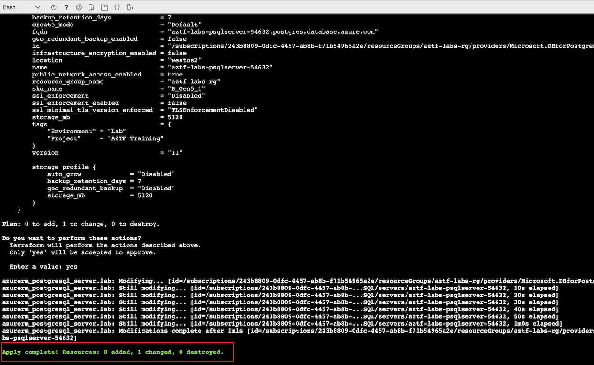

# Data Source & Key Vault

Lab Objective:
- Use data sources to obtain user data
- Create a key vault to protect a database password
- Update database resource to use secured password

## Preparation

If you did not complete lab 3.4, you can simply copy the solution code from that lab (and do terraform apply) as the starting point for this lab.

## Lab

### Add Data Sources

Access to the key vault we will create shortly requires an access policy allowing your user to write and read secrets in the vault.  The access policy will require a couple bits of information about your user that we will need to read from data sources.  

One of the data sources we will use requires a new provider "azuread".  Open "main.tf" and add "azuread" to the required_providers sub-block and as a new provider block:
```
terraform {
  required_providers {
    random = {
      source  = "hashicorp/random"
      version = "~> 2.3.0"
    }
    azurerm = {
      source  = "hashicorp/azurerm"
      version = ">= 2.40, < 3.0"
    }
    azuread = {
      source = "hashicorp/azuread"
      version = "~> 2.0"
    }
  }
  backend "azurerm" {
    resource_group_name  = "terraform-course-backend"
    container_name       = "tfstate"
    key                  = "cprime.terraform.labs.tfstate"
  }
  required_version = ">= 1.0.0"
}

provider "random" {
}

provider "azurerm" {
  features {}
  # Set the following flag to avoid an Azure subscription configuration error
  skip_provider_registration = true
}

provider "azuread" {
  use_msi = false
}
```

Now create a new file "vault.tf".

In this new file, add two data sources.  The first data source reads information about your user accessing the Azure resource manager.  The second data source reads information from Active Directory about a group your user is a member of.
```
data "azurerm_client_config" "current" {}

data "azuread_group" "lab" {
  display_name = "Students"
}
```

### Create Key Vault

We can new declare the resources for a key vault.

Add three new resources to the "vault.tf" file:

1. A random password that will be the new database password.
```
resource "random_password" "dbpassword" {
  length           = 16
  min_numeric      = 1
  special          = true
  override_special = "_%#"
}
```

2. A key vault to hold secrets.  Notice the references to the data sources.
```
resource "azurerm_key_vault" "lab" {
  name                = "aztf-key-vault-${random_integer.suffix.result}"
  location            = local.region
  resource_group_name = azurerm_resource_group.lab.name
  tenant_id           = data.azurerm_client_config.current.tenant_id

  sku_name = "standard"

  access_policy {
    tenant_id = data.azurerm_client_config.current.tenant_id
    object_id = data.azuread_group.lab.object_id
    secret_permissions = [
      "get",
      "set",
      "delete",
      "purge",
      "list"
    ]
  }

  tags = local.common_tags
}
```

3. A key vault secret for the generated random password
```
resource "azurerm_key_vault_secret" "lab-db-pwd" {
  name         = "dbpassword"
  value        = random_password.dbpassword.result
  key_vault_id = azurerm_key_vault.lab.id
}
```

Since one of data sources uses a new provider "azuread", you must run terraform init:
```
terraform init
```

Run terraform validate to make sure you have no errors:
```
terraform validate
```

Run terraform plan:
```
terraform plan
```

Run terraform apply.  The key vault might take a couple minutes to create.
```
terraform apply
```


Let's now see that Terraform treats a random password resource as a sensitive value. Run the following to verify that the value is not actually shown and is displayed as “(sensitive value)”.  This ensures that the secure password does not leak into logs.

```
terraform state show azurerm_key_vault_secret.lab-db-pwd
terraform state show random_password.dbpassword
```


### Viewing Results in Azure Portal

Let’s now confirm the secret was created in Azure.

Go to the Azure Portal.  Type “vault” and select the “Key vaults” auto-suggestion.


Click on the key vault.


Click on Secrets to confirm your database password secret was created.


### Update Database to use Secure Password

We now want to use this secure password for the database.

Open the “database.tf” file.

For the “administrator_login_password” argument, use the following for the value:  <code>azurerm_key_vault_secret.lab-db-pwd.value</code>


Run terraform plan.  Note that the database server will be updated in place and does not need to be re-created.
```
terraform plan
```

Run terraform apply
```
terraform apply
```



:bangbang: NOTE: Using credentials stored in a key vault helps secure the database.  Applications that need to access the database should use provisioning logic to extract the password from the vault and inject it into the application.  Although the password in the vault can be revealed to privileged users, the password should not be saved in files on an application server.
