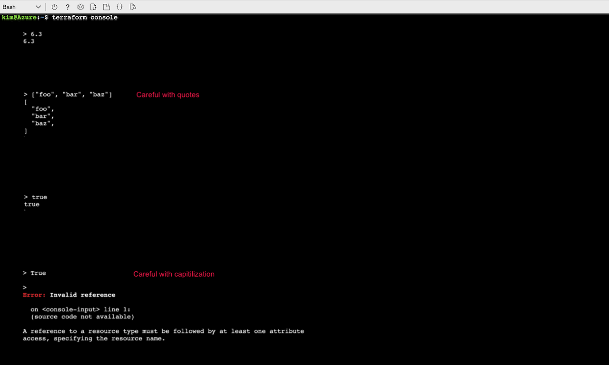
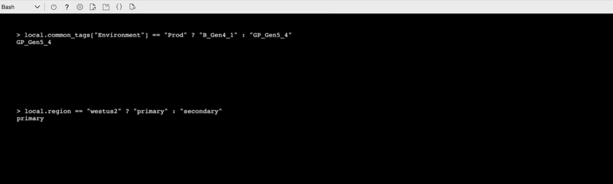
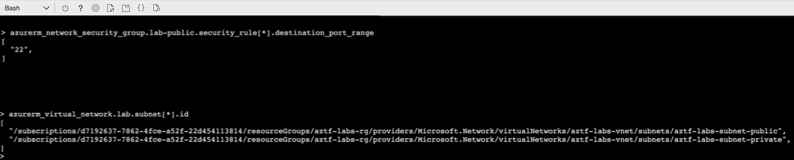
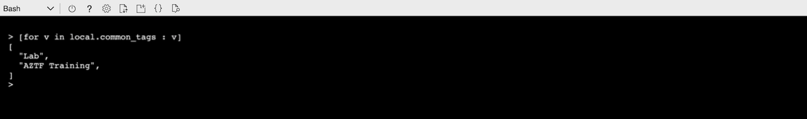

# Expressions

Lab Objectives:
- Construct various types of expressions
- Use "terraform console" as development tool

## Lab

In this lab we will be using the “terraform console” command.  This opens the command line into a mode that allows you to type in expressions that are then evaluated.

Open Terraform console on the command line:

```
terraform console
```

At the “>” prompt, enter the following to see what they evaluate to.

#### Literal Values:

```
> 6.3

> ["foo", "bar", "baz"]   

> true    
```

<details>

 _<summary>Click to see results of above</summary>_


</details>

:information_source: Be careful when typing the quotes in the 2nd example above. Also, note that "True" will return an error in the 3rd example.

#### Conditional:

```
> local.common_tags["Environment"] == "Prod" ? "B_Gen4_1" : "GP_Gen5_4"

> local.region == "westus2" ? "primary" : "secondary"
```
<details>

 _<summary>Click to see results of above</summary>_


</details>

#### Splat Expression:

```
> azurerm_network_security_group.lab-public.security_rule[*].destination_port_range
```

_Get a list of the ids for the subnets in a VNet:_

```
> azurerm_virtual_network.lab.subnet[*].id
```

<details>

 _<summary>Click to see results of above</summary>_


</details>

#### for expression:

_Extract the values of the common tags:_

```
> [for v in local.common_tags : v]
```

<details>

 _<summary>Click to see results of above</summary>_


</details>

<br /><br />
To exit the Terraform console, type:

```
> exit
```
