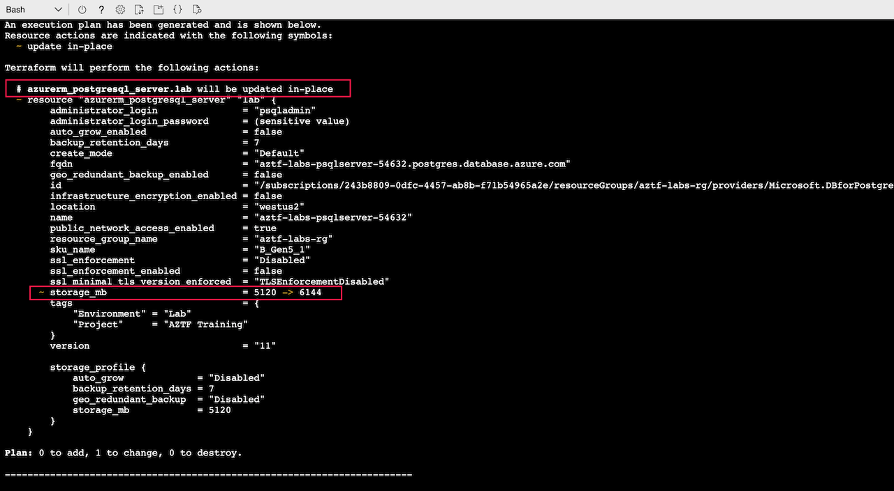

# Variables

Lab Objective:
- Add input variables to your configuration

# Preparation

If you did not complete lab 3.5, you can simply copy the solution code from that lab (and do terraform apply) as the starting point for this lab.

# Lab

First, think about what you might want to parameterize in the configuration you have defined so far.

:question: What variations might you want to support?  Should there be a default value for some parameters, and which should be required?

Create a file called variables.tf

For this lab, we will create variables for the following:
-	Region
- VM password
-	Database storage amount (default value is 5120)

Try your hand at writing the variable declarations in variables.tf.  Run terraform validate to check for syntax errors.

Compare your code to the solution below (or to the variables.tf file in the solution folder).

<details>

 _<summary>Click to see solution for variables</summary>_

```
variable "region" {
  type = string
}

variable "vm_password" {
  description = "6-20 characters. At least 1 lower, 1 cap, 1 number, 1 special char."
  type = string
}

variable "db_storage" {
  type = number
  default = 5120
}
```
</details>

Now, use a variable reference to replace the corresponding target expressions in the configuration files.  There should be three places:

- Set the region local value in main.tf with var.region
- Set the admin_password value in vm.tf with var.vm_password
- Set the storage_mb value in database.tf with var.db_storage

Run terraform validate to check for errors.

### Setting the Variable Values

Create a file called terraform.tfvars

Set the values for the variables in that file.  Keep the region the same as before to avoid recreating the entire infrastructure.  Keeping the password the same as before will avoid re-creating the virtual machine.  The database storage value must be a multiple of 1024 and greater than 5120.

```
region = "westus2"
db_storage = 6144
vm_password = "<PASSWORD>"
```

:bangbang: Be sure to replace &lt;PASSWORD&gt; with the actual password string above. (If you forgot the VM password, you can look in the solution folder of a prior lab.)

> Storing passwords in a file is a strongly discouraged practice.  The virtual machine really should be using an SSH key for access instead of a password.  Including a password in the variables file is only for the convenience of this lab and should not be done in actual practice.

Run terraform plan:
```
terraform plan
```

:information_source: **Changing the database storage can be updated in place. If you changed the VM password, the virtual machine will need to be re-created.**



Run terraform apply:
```
terraform apply
```

### Extra Credit -- Validation

If you still have time, add a validation block for the db_storage variable in variables.tf to verify the db_storage variable is greater than or equal to 5120 and is a multiple of 1024.

```
variable "db_storage" {
  type = number
  default = 5120

  validation {
    condition = var.db_storage >= 5120 && var.db_storage % 1024 == 0
    error_message = "Minimum db storage is 5120 and must be multiple of 1024."
  }
}
```

Change the value of db_storage in <code>terraform.tfvars</code> file to 6140.  Run terraform plan.  You should get an error.  Change the value back to a valid value of 6144.
