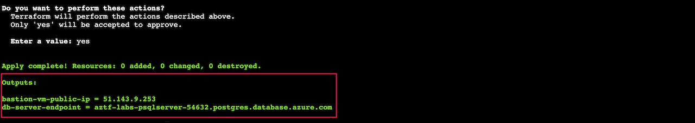

# Outputs

Lab Objective:
- Add outputs for resource attributes

## Preparation

If you did not complete lab 4.2, you can simply copy the solution code from that lab (and do terraform apply) as the starting point for this lab.

## Lab

Look through the configuration files, and think about what outputs you might want to provide to users who instantiate this configuration.

:question: What attributes have you needed to find so you can use them in running commands.

For this lab, we will output two values:
- Public IP of virtual machine (to include in SSH command)
- Database endpoint (to include in a psql command to connect to the database)

Create a file called “outputs.tf”

Add outputs for the above two attributes to the file.  Try your hand at it first before looking at the solution.  You might want to take a look at the Terraform documentation to see what attributes are exported for the two resources:
- azurerm_linux_virtual_machine
- azurerm_postgresql_server

<details>

 _<summary>Click to see solution for outputs</summary>_

```
output "bastion-vm-public-ip" {
  value = azurerm_linux_virtual_machine.lab-bastion.public_ip_address
}

output "db-server-endpoint" {
  value = azurerm_postgresql_server.lab.fqdn
}
```
</details>

Run terraform validate to check for syntax errors:
```
terraform validate
```

Run terraform plan. See that the execution plan will be adding the outputs to the state. Since the output values are from existing state, the plan will also show you the values.  Are they what you expect?
```
terraform plan
```


Run terraform apply:

```
terraform apply
```

The output values will show up in the console at the end of the apply console output.



You can also use terraform output to view the output values now that they are part of the Terraform state.

```
terraform output bastion-vm-public-ip

terraform output db-server-endpoint
```


