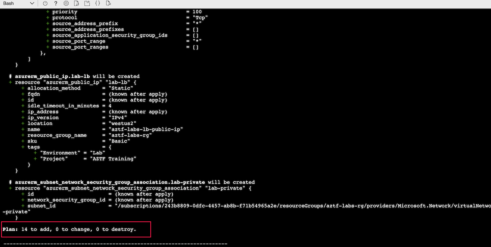
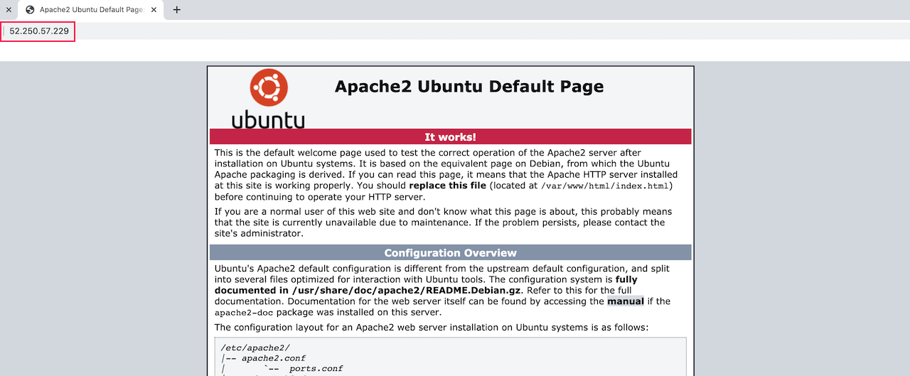

# Multiplicity

Lab Objective:
- Use for_each for multiple database firewall rules
- Use count for multiple VMs in an availability set

## Preparation

If you did not complete lab 4.3, you can simply copy the code from that lab (and do terraform apply) as the starting point for this lab.

## Lab

### Using for_each

Open database.tf file.

Notice that we have two firewall rules that are essentially the same except for the name suffix and the ip addresses.  This would be a good case for using one of the multiplicity meta-arguments.  Can you articulate why for_each would be better to use in this case than using count?

The for_each operation requires a map.  What are the pieces of information that differ between the firewall rules?  Think about what the map might look like to capture the different values.

Open main.tf to edit.

In the locals block add a new map called db_fw_rules for the firewall rules.  The map keys could be the name suffix ("private" and "bastion") and the values could be a sub-map for the start_ip and end_ip values.  Try your hand at writing the map, then check the solution below (or look in main.tf in the solution folder.)

<details>

 _<summary>Click to see solution for fire wall rule map</summary>_

```
  db_fw_rules = {
    private = {
      start_ip = cidrhost(azurerm_subnet.lab-private.address_prefixes[0],0)
      end_ip   = cidrhost(azurerm_subnet.lab-private.address_prefixes[0],255)
    },
    bastion = {
      start_ip = azurerm_linux_virtual_machine.lab-bastion.private_ip_address
      end_ip   = azurerm_linux_virtual_machine.lab-bastion.private_ip_address
    }
  }
```
</details>

Open database.tf

Replace the two firewall rule resources by a single resource that uses the for_each.  Notice that we can use the map key as well as the map values.
```
resource "azurerm_postgresql_firewall_rule" "lab" {
  for_each = local.db_fw_rules

  name                = "aztf-labs-fwrule-${each.key}"
  resource_group_name = azurerm_resource_group.lab.name
  server_name         = azurerm_postgresql_server.lab.name
  start_ip_address    = each.value.start_ip
  end_ip_address      = each.value.end_ip
}
```

Run terraform validate:
```
terraform validate
```

Run terraform plan.  You should get a plan that will destroy the original firewall resources and create replacement firewall rule resources.

:question: Can you identify why this is the case even though the Azure name for the two rules has not changed?  (*Hint: What other name change could cause a resource to be re-created?*)
```
terraform plan
```


Run terraform apply.

> Note, you might get an error that the replacement resources could not be created due to the resource already existing.  This is due to a timing conflict between the destroy and create processing when the Azure name is the same between the old and new instances.  The destroy should have succeeded and you can simply run terraform apply a second time to perform the create.

```
terraform apply
```


### Using count

To show the use of count, we will create an availability set of virtual machines behind a load balancer.

Create a new file called “lb.tf”

Copy the contents from the lb.tf file in the solution directory into your new file.  Notice that it declares five new resoureces:

* A public IP for the load balancer
* A load balancer
* A backend address pool for the virtual machines behind the load balancer
* A health probe for the load balancer to detect whether or not a virtual machine is healthy
* A routing rule for directing incoming traffic to the virtual machines

Do not make any changes.  You can examine the file, but leave it as is.

Open outputs.tf

Add a new output so we can easily get the load balancer public IP:
```
output "load-balancer-public-ip" {
  value = azurerm_public_ip.lab-lb.ip_address
}
```

Create a new file called “vm-cluster.tf”

We will create four resources in this file.  Notice that we will be using the count meta-argument in three of the resources to create multiple instances of the resources.  The count will be based on a new local (which we will add later) to set the size of the VM cluster.

1.  Add a network interface for the virtual machines to have a private IP on the private subnet.  We use count to create a separate NIC for each virtual machine.
```
resource "azurerm_network_interface" "lab-app" {
  count               = local.cluster_size
  name                = "aztf-labs-nic-${count.index}"
  location            = local.region
  resource_group_name = azurerm_resource_group.lab.name

  ip_configuration {
    name                          = "labConfiguration"
    subnet_id                     = azurerm_subnet.lab-private.id
    private_ip_address_allocation = "dynamic"
  }

  tags = local.common_tags
}
```

2. Add an association between the virtual machines and the load balancer.  We use count to create a separate association for each virtual machine.
```
resource "azurerm_network_interface_backend_address_pool_association" "lab-app" {
  count                   = local.cluster_size
  network_interface_id    = azurerm_network_interface.lab-app[count.index].id
  ip_configuration_name   = "labConfiguration"
  backend_address_pool_id = azurerm_lb_backend_address_pool.lab.id
}
```

3. Add an availability set.  We do not use count here since we only need one availability set for the entire cluster.
```
resource "azurerm_availability_set" "lab-app" {
  name                         = "aztf-labs-avset"
  location                     = local.region
  resource_group_name          = azurerm_resource_group.lab.name
  tags                         = local.common_tags
}
```

4. Add the virtual machine.  We use count here to create multiple virtual machines.  Note that the VMs are identical other than references to count.index.
```
resource "azurerm_linux_virtual_machine" "lab-app" {
  count                 = local.cluster_size
  name                  = "aztf-labs-app-vm-${count.index}"
  resource_group_name   = azurerm_resource_group.lab.name
  location              = local.region
  size                  = "Standard_B1s"
  network_interface_ids = [azurerm_network_interface.lab-app[count.index].id]
  availability_set_id   = azurerm_availability_set.lab-app.id
  admin_username        = "adminuser"
  admin_password        = var.vm_password
  disable_password_authentication = false

  os_disk {
    caching              = "ReadWrite"
    storage_account_type = "Standard_LRS"
  }

  source_image_reference {
    publisher = "Canonical"
    offer     = "UbuntuServer"
    sku       = "16.04-LTS"
    version   = "latest"
  }

  tags = local.common_tags
}
```

Open main.tf for edit.

Add a new local value for cluster_size.  Set it to 2.

Add a new security group for the private subnet that will allow traffic to ports 80 and 22 on our new virtual machines.  Add it below the current security group.
```
resource "azurerm_network_security_group" "lab-private" {
  name                = "aztf-labs-private-sg"
  location            = local.region
  resource_group_name = azurerm_resource_group.lab.name

  security_rule {
    name                       = "HTTP-Access"
    priority                   = 100
    direction                  = "Inbound"
    access                     = "Allow"
    protocol                   = "Tcp"
    source_port_range          = "*"
    destination_port_range     = "80"
    source_address_prefix      = "*"
    destination_address_prefixes = azurerm_subnet.lab-private.address_prefixes
  }

  security_rule {
    name                       = "SSH-Access"
    priority                   = 110
    direction                  = "Inbound"
    access                     = "Allow"
    protocol                   = "Tcp"
    source_port_range          = "*"
    destination_port_range     = "22"
    source_address_prefix      = "*"
    destination_address_prefixes = azurerm_subnet.lab-private.address_prefixes
  }
}
```

Associate the new security group to the private subnet.  Add it below the current security group association resource.
```
resource "azurerm_subnet_network_security_group_association" "lab-private" {
  subnet_id                 = azurerm_subnet.lab-private.id
  network_security_group_id = azurerm_network_security_group.lab-private.id
}
```

Okay, that's a lot of edits.  Be sure to run terraform validate to make sure you got everything.
```
terraform validate
```

Run terraform plan to verify what will be created.  Scroll through the plan.  Does it match what you would expect?  Notice how the plan uses an array index to reference the multiple instances of a resource.
```
terraform plan
```



Run terraform apply:
```
terraform apply
```

### Install HTTP server on VMs

If you have extra time for the lab, you can test out the new cluster.

You will need to install an HTTP server on each VM that you can try reaching through the load balancer.

The public IP for the new VMs is actually the public IP of the load balancer, so you cannot SSH to the cluster VMs directly.  If you want to SSH to the new instances to install an HTTP server, you must go through the bastion host.

SSH to the bastion host, using the public IP of that VM (as you did in an earlier lab).


To SSH to the cluster VMs, you will need their private IPs.  You can find those by viewing the cluster VMs in the Azure Portal, or by using terraform show to see the state of the resources. Note that you want the private IPs not the public IPs of the cluster VMs.


From the bastion host, ssh using the private IP of the new VMs.  You’ll be prompted for the password.
```
ssh adminuser@<private_ip>
```


On each of the new VMs, run the following command to start a simple HTTP server on each VM.
```
sudo apt-get install -y apache2
```


You can now go to a browser and use the public IP of the load balancer to hit the HTTP server on the VMs.


