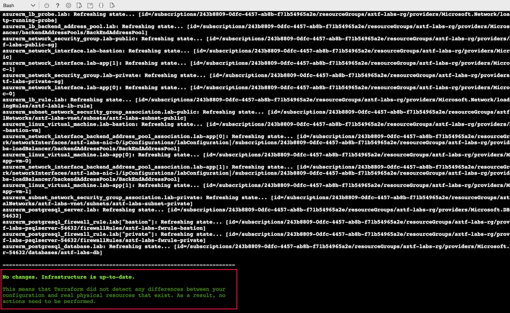

# Dynamic Blocks

Lab Objective:
- Implement a dynamic block to handle multiple security group rules

## Preparation

If you did not complete lab 4.4, you can simply copy the code from that lab (and do terraform apply) as the starting point for this lab.

## Lab

Open main.tf for edit.

Notice that within the network security group resource for the private subnet, there are multiple security group rule sub-blocks.  We will replace the multiple sub-blocks by a single dynamic block.

A dynamic block uses the for_each construct, which you now know requires a map of values by which to populate values for each iteration.  Since there are two security group rules, the map will have two keys.  What might you use as the map key for the different security rules?

In the locals block in main.tf, add a new map with two keys and the following values for each key:
* priority
*	direction
*	access
*	protocol
*	destination_port

Try your hand at writing the map before looking at the solution below (or in main.tf in the solution directory).

<details>

 _<summary>Click to see solution for security group map</summary>_

```
  sg_rules = {
    HTTP-Access = {
      priority               = 100,
      direction              = "Inbound",
      access                 = "Allow",
      protocol               = "Tcp",
      destination_port_range = 80
    },
    SSH-Access = {
      priority               = 110,
      direction              = "Inbound",
      access                 = "Allow",
      protocol               = "Tcp",
      destination_port_range = 22
    }
  }
```
</details>

Now replace the security group rules in the private network security group with a dynamic block.  Try your hand at it, then compare your code to the solution below (or in main.tf in the solution folder).

<details>

 _<summary>Click to see solution for dynamic block</summary>_

```
  dynamic "security_rule" {
    for_each = local.sg_rules
    content {
      name                         = security_rule.key
      priority                     = security_rule.value.priority
      direction                    = security_rule.value.direction
      access                       = security_rule.value.access
      protocol                     = security_rule.value.protocol
      source_port_range            = "*"
      destination_port_range       = security_rule.value.destination_port_range
      source_address_prefix        = "*"
      destination_address_prefixes = azurerm_subnet.lab-private.address_prefixes
    }
  }
```
</details>

When you are done, run terraform validate:
```
terraform validate
```

Run terraform plan.  If you have refactored the code correctly, the plan should come back with no changes to make.
```
terraform plan
```


