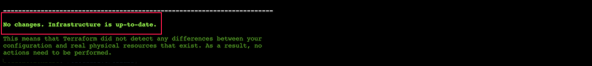

# Functions

Lab Objective:
- Use functions to merge tags and determine VM cluster size

## Preparation

If you did not complete lab 4.6, you can simply copy the code from that lab (and do terraform apply) as the starting point for this lab.

## Lab

### Tag Merge

Open the file variables.tf.

Add a new variable to accept additional tags to set on our resources.  What should be the type for the tags variable?  (Hint: take a look at the existing tags local value in main.tf.)

<details>

 _<summary>Click to see solution for tags variable</summary>_

```
variable "tags" {
  type = map(string)
  default = {}
}
```
</details>

Open the file main.tf.

Modify the common_tags local value to merge the tags input variable and the existing tag map.  What function would you use?  Try your hand at writing the solution before checking the solution below.  You can use terraform validate to check the syntax correctness of your solution.

<details>

 _<summary>Click to see solution for merging tags variable and local value</summary>_

```
  common_tags = merge(var.tags,{
    Environment = "Lab"
    Project     = "AZTF Training"
  })
```
</details>

Run terraform validate:
```
terraform validate
```

Run terraform plan and confirm that nothing needs to be updated.  Why is that?
```
terraform plan
```

Now open the terraform.tfvars file.  Add a value for tags variable:
```
tags = {
  Owner = "Development"
}
```

Run terraform plan and see that the tags for numerous resources will be updated:
```
terraform plan
```


Run terraform apply:
```
terraform apply
```

### Cluster Size Calculation

Now let’s try some more functions.

Open the file main.tf.

Add a lookup map as follows in the locals block right above the cluster_size local value:

```
  size_spec = {
    low = {
      cluster_size = 1
    },
    medium = {
      cluster_size = 2
    },
    high = {
      cluster_size = 3
    }
  }
```

Add two more variables to variables.tf:

* **node_count** of type number with default as null

* **load_level** of type string with default as empty string

<details>

 _<summary>Click to see solution for variables node_count and load_level</summary>_

```
variable "node_count" {
  type = number
  default = null
}

variable "load_level" {
  type = string
  default = ""
}
```
</details>

We now want a way to determine cluster_size according to the following criteria:
*	Use input variable node_count if it is not null
*	Otherwise use the input variable load_level to lookup a cluster_size value from the size_spec map
*	If both node_count and load_level input variables are undefined, then the default cluster size should be 1

:question: Can you think of what this would look like?

*Hint: It will be a combination of coalesce, lookup and try functions.*

Try your hand at writing out the computation.  In the main.tf file, replace the current hard-coded local value of cluster_size with the computation.  Compare your solution to that below (or in the main.tf file in the solution folder).

<details>

 _<summary>Click to see a solution for computing cluster_size</summary>_

```
  cluster_size = try(coalesce(var.node_count, lookup(local.size_spec,var.load_level).cluster_size), 1)
```
</details>

Run terraform validate:
```
terraform validate
```

Run terraform plan:
```
terraform plan
```

:question: What is the effect in the execution plan on the number of application nodes? What does that tell you about the computed cluster size and how that value was derived?

Now edit the terraform.tfvars file to set the one of the input variables.

* Set the value of load_level to “high”.

Run terraform plan:
```
terraform plan
```

:question: What is the effect in the execution plan on the number of application nodes? What does that tell you about the computed cluster size and how that value was derived?

Add another setting in terraform.tfvars:

* Set the value of node_count to 2.

Run terraform plan:
```
terraform plan
```

:question: What is the effect in the execution plan on the number of application nodes? What does that tell you about the computed cluster size and how that value was derived?

You should have seen the following behavior (based on there being two VMs in the cluster to start with):
* When the load_level and node_count are both missing from terraform.tfvars, the cluster_size derivation should have used the default value of 1, and the plan should have shown one virtual machine (plus its network interface and backend address pool association) to be destroyed.

* When you set load_level to "high" in terraform.tfvars, the cluster_size derivation should have used the lookup value of 3, and the plan should have shown one virtual machine (plus its network interface and backend address pool association) to be created.

* When you set the node_count to 2 in terraform.tfvars, the cluster_size derivation should have used that value, and the plan should have shown no change in the number of virtual machines.


### Extra Credit

If you have extra time and are up for a challenge, see if you can figure out how to do the following.

Use a variety of functions to use the values from local.common_tags to construct an expression that evaluates to:

“aztf-training-lab-development”

Test your expression using terraform console (i.e., don’t change the actual terraform code)

<details>

 _<summary>Click to see one possible solution.</summary>_


</details>
