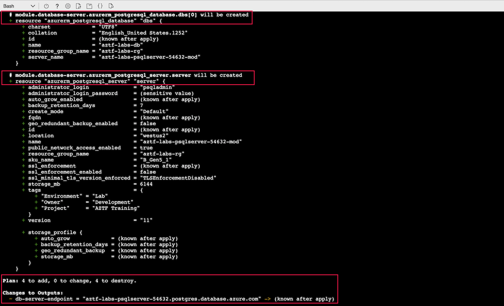

# Calling a Module

Lab Objective:
- Use a module to create a database

## Preparation

If you did not complete lab 4.6, you can simply copy the solution code from that lab (and do terraform apply) as the starting point for this lab.

## Lab

Go the Terraform registry (https://registry.terraform.io/search/modules?provider=azurerm) to see what modules are available for creating a Postgresql server.  What do you find?

The module we want to use in this lab is at:

* https://registry.terraform.io/modules/Azure/postgresql/azurerm/2.1.0

Be sure to select version 2.1.0.

Look through the module documentation to see how it should be used.  Look at the inputs section to see what input arguments are required versus optional.  Notice how this one module can create many of the resources you have in your database.tf file.  The module therefore provides a level of abstraction.

Open database.tf

Using the module documentation as a guide, add a call to the module to create a database server and database instance.  Although the module could be used to create firewall rules, for the sake of this lab, we will still create the firewall rules separately.

* Specify the version explicitly as "2.1.0" (since that is what this lab was based on).

* Most of the arguments for the module can be copied directly from the existing resources.  The similar naming is a sign of a well-designed module to avoid confusion.

* To avoid conflicts with the name of the existing database server, append an extra suffix "-mod" to the server_name argument in the module to differentiate it.

* Omit module arguments in the documentation that were not set in the existing resources.

Compare your code to the solution below (or in the database.tf file in the solution folder).

<details>

 _<summary>Click to see solution for module call</summary>_

```
module "database-server" {
  source  = "Azure/postgresql/azurerm"  #from Terraform registry
  version = "2.1.0"

  location                = local.region
  resource_group_name     = azurerm_resource_group.lab.name
  server_name             = "aztf-labs-psqlserver-${random_integer.suffix.result}-mod"
  sku_name                = "B_Gen5_1"
  server_version          = "11"
  storage_mb              = var.db_storage
  ssl_enforcement_enabled = false

  administrator_login     = "psqladmin"
  administrator_password  = azurerm_key_vault_secret.lab-db-pwd.value

  db_names                = ["aztf-labs-db"]
  db_charset              = "UTF8"
  db_collation            = "English_United States.1252"

  tags = local.common_tags
}
```
</details>

In the <code>azurerm_postgresql_firewall_rule</code> resource, update the server name argument to reference the module instead of the server resource.  Look at the module documentation to see what the exported attribute for the server name is.  Be sure to include the "module" prefix in the reference.

<details>

 _<summary>Click to see solution for reference to module server name</summary>_

```
  server_name         = module.database-server.server_name
```
</details>

Once you have the module configured, delete or comment out the existing two resources:
  * azurerm_postgresql_server
  * azurerm_postgresql_database

Open outputs.tf

Update the database endpoint output value in outputs.tf to return the db server endpoint from the module.  Look at the documentation to see what the reference should look like.


<details>

 _<summary>Click to see solution for module server endpoint output</summary>_

```
output "db-server-endpoint" {
  value = module.database-server.server_fqdn
}
```
</details>

If you try running terraform validate at this point, you would get an error that you must first run terraform init.  Do you know why you would need to call init?

Run terraform init:
```
terraform init
```


Run terraform validate:
```
terraform validate
```

Run terraform plan.  You should see that Terraform will destroy the former database and re-create a new database, as well as replace the firewall rules.  Can you tell why from looking at the plan?
```
terraform plan
```




Run terraform apply:
```
terraform apply
```
