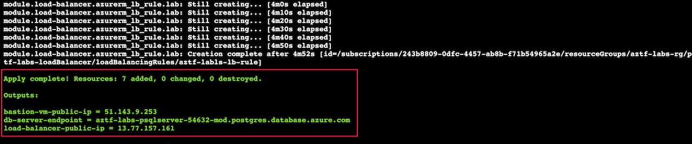

# Creating a Module

Lab Objective
- Convert the load balancer configuration in your code to a module
- Use the new module in your configuration

## Preparation

If you did not complete lab 5.1, you can simply copy the code from that lab (and do terraform apply) as the starting point for this lab.

## Lab

### Modify code to implement the module

In this lab we will convert the load balancer configuration to be a module implementation.  We will implement the module as a nested module, though in actual practice this module should probably be a module on its own.

Create a subdirectory called “load-balancer”.
```
mkdir load-balancer
```

Move the “lb.tf” file to the “load-balancer” directory and rename the file “main.tf”.  (Recall that each module should have a main.tf file as the principal configuration entry point.)

Within the “load-balancer” directory, create a file called “variables.tf”.

Go through the **load balancer main.tf** file and look for what arguments will need values passed into the module.  (The load balancer module cannot access the parent resources directly.)  These are candidates for the input variables for the load balancer module.

In the load balancer variables.tf file, add variables for the following:
  * location
  * resource group name
  * tags

Try to write the variables.tf code on your own initially. Compare your code to the solution below (or in the load-balancer/variables.tf file in the solution folder).

<details>

 _<summary>Click to see solution for load balancer module variables</summary>_

```
variable "location" {
  type = string
}

variable "resource_group_name" {
  type = string
}

variable "tags" {
  type = map(string)
}
```
</details>

Open the load-balancer main.tf file and use these variables to populate the corresponding arguments in all of the resources in the file.

Within the “load-balancer” directory, create a file called outputs.tf”.

Go through the root module's files to see where load balancer attributes are referenced.  These are candidates for output values from the load balancer module.

In the load balancer outputs.tf file, add outputs for the following:
  * load balancer backend address pool id
  * load balancer public ip address

Try to write this on your own initially.  Compare your code to the solution below (or in the load-balancer/outputs.tf file in the solution folder).

<details>

 _<summary>Click to see solution for load balancer module outputs</summary>_

```
output "backend_address_pool_id" {
  value = azurerm_lb_backend_address_pool.lab.id
}

output "public_ip_address" {
  value = azurerm_public_ip.lab-lb.ip_address
}
```
</details>

At this point, you now have a nested module with inputs and outputs defined.  Next, let's use the new module.

### Modify code to call the new module

Open the file vm-cluster.tf in the root module.  Add a call to the load balancer module, setting argument values corresponding to the input variables for the load balancer.  The module source should be "./modules/load-balancer".

Try writing this on your own first. Compare your code to the solution below (or in the vm-cluster.tf file in the solution folder).

<details>

 _<summary>Click to see solution for load balancer module outputs</summary>_

```
module "load-balancer" {
  source = "./load-balancer"

  location            = local.region
  resource_group_name = azurerm_resource_group.lab.name
  tags                = local.common_tags
}
```
</details>

In the root module, you now need to use the module outputs to replace references to the load balancer attributes.  Be sure to use the "module" prefix in the references.

* Update the reference to backend_address_pool_id in vm-cluster.tf
* Update the reference to load-balancer-public-ip in outputs.tf in the root module.

### Execute terraform commands

To run the terraform commands, you must be in the root module's directory.  **Verify you are in the /clouddrive folder.**  If not, move to the directory.

Let's now validate the code you've written.  If you run terraform validate at this point, you will get an error that you need to run terraform init first.  Do you recall why this is necessary?

Run terraform init.
```
terraform init
```

Run terraform validate and fix errors as appropriate.
```
terraform validate
```

Run terraform plan. You will see that Terraform wants to replace the load balancer and various ancillary resources.
```
terraform plan
```


Run terraform apply:
> NOTE: You may get an error that the public IP was not able to be re-created since its predecessor was not yet deleted (i.e., a name conflict).  You should be able to just re-run terraform apply again since the resources should have been fully destroyed by the conclusion of the first apply.
```
terraform apply
```




If you had time to install the Apache HTTP server on the cluster VMs back in Multiplicity lab 4.4, then you should be able to again use the load balancer public IP in a browser to hit the HTTP server on the load balanced VMs.


### Extra Credit

If you are ambitious and have time, try adding two more variables to the load balancer module:
  * port mapping  (key-value pairs to set the protocol, frontend_port, and backend_port of the load balancer rule)
  * health probe (key-value pairs to set the protocol, port, and path of the load balancer health probe)

Consider using the object data type for these.

Add these to the load-balancer/variables.tf code. Compare your code to the solution below (or in the load-balancer/variables.tf file in the solution folder).

<details>

 _<summary>Click to see solution for load balancer module variables in load-balancer/variables.tf</summary>_

```
variable "port_mapping" {
  description = "map with keys: protocol, frontend_port, backend_port"
  type = object ({
    protocol      = string,
    frontend_port = number,
    backend_port  = number
  })
}

variable "health_probe" {
  description = "map with keys: protocol, port, request_path"
  type = object ({
    protocol     = string,
    port         = number,
    request_path = string
  })
}
```
</details>

In load-balancer/main.tf, replace the values for the port mappings and health probes with the appropriate variables.

Compare your code to the solution below (or in the load-balancer/main.tf file in the solution folder).

<details>

 _<summary>Click to see solution for load balancer module variables in load-balancer/main.tf</summary>_

```
resource "azurerm_lb_probe" "lab" {
  resource_group_name = var.resource_group_name
  loadbalancer_id     = azurerm_lb.lab.id
  name                = "http-running-probe"
  protocol            = var.health_probe["protocol"]
  port                = var.health_probe["port"]
  request_path        = var.health_probe["request_path"]
}

resource "azurerm_lb_rule" "lab" {
  resource_group_name            = var.resource_group_name
  loadbalancer_id                = azurerm_lb.lab.id
  name                           = "aztf-labls-lb-rule"
  protocol                       = var.port_mapping["protocol"]
  frontend_port                  = var.port_mapping["frontend_port"]
  backend_port                   = var.port_mapping["backend_port"]
  frontend_ip_configuration_name = "publicIPAddress"
  backend_address_pool_id        = azurerm_lb_backend_address_pool.lab.id
  probe_id                       = azurerm_lb_probe.lab.id
}
```

</details>

Open the file vm-cluster.tf in the root module.  In the call to the load-balancer module add arguments to set the port_mapping and the health_probe values.

Try writing this on your own first. Compare your code to the solution below (or in the vm-cluster.tf file in the solution folder).

<details>

 _<summary>Click to see solution for setting load balancer module variables in vm_cluster.tf</summary>_

```
module "load-balancer" {
  source = "./load-balancer"

  location            = local.region
  resource_group_name = azurerm_resource_group.lab.name
  tags                = local.common_tags

  port_mapping = {
    protocol      = "Tcp"
    frontend_port = 80
    backend_port  = 80
  }
  health_probe = {
    protocol     = "Http"
    port         = 80
    request_path = "/"
  }
}
```
</details>

Run terraform validate:
```
terraform validate
```

> After changing the module code, you might have expected to need to rerun terraform init to update the cached module code.  But since the load-balancer module is a nested module in a subdirectory, Terraform does not actually cache the module code and instead uses the code in the subdirectory. (The original init done earlier in this lab was for Terraform to "register" that the module is being used in the configuration.)

Run terraform plan:
```
terraform plan
```


Verify there are no changes needed to the infrastructure.
